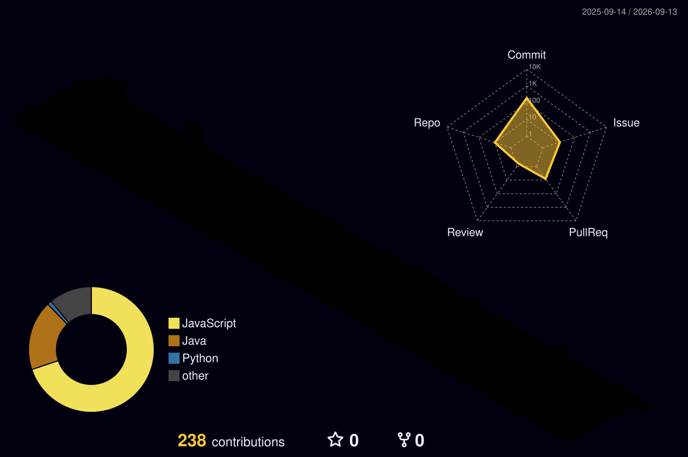

  <h3><b>Core Stack</b></h3>
  
  
  
  
  
  
  
  
  

  <h3><b>Entorno / Herramientas</b></h3>
  
  
  
  
  
  
  
  
  
  
  
  

  <h3><b>Backend / Cloud</b></h3>
  
  
  
  
  
  
  
  

  <h3><b>Diseño / Multimedia</b></h3>
  
  
  
  
  
  
  
  
  

  <h3><b>Calidad / Docs</b></h3>
  
  
  
  
  
  
  
  
  
  

  <h3><b>Oficina / OS</b></h3>
  
  
  
  
  

<table border="0">
  <tr>
    <td width="50%" valign="top">
      <h3><b>📍 Sobre mi "Batalla"</b></h3>
      

        Soy <b>elmoteroloco</b>, un explorador del código que cree en aprender haciendo. 
        Este mapa 3D no es solo estética; es el registro de mi constancia. Cada bloque 
        representa un paso más en el dominio de herramientas como Python, React y el 
        vasto ecosistema de GitHub.
      

      

        <i>"Las montañas se escalan paso a paso, y las baldosas flojas se fijan con código."</i>
      

    </td>
    <td width="50%" align="center">
      
    </td>
  </tr>
</table>
